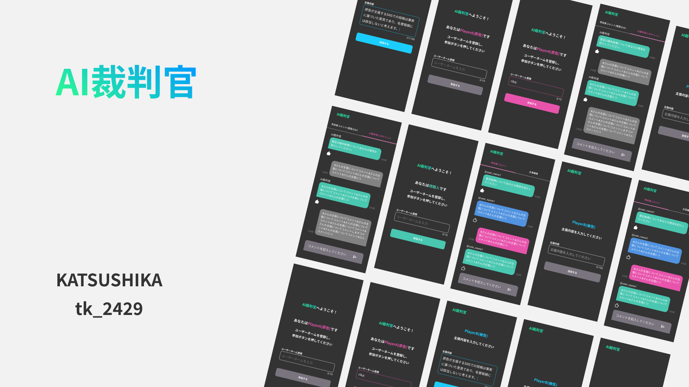

# AI裁判官

## 製品概要

### 背景(製品開発のきっかけ、課題等）

人間同士の話し合いにおいて判決を出す場合に
相手に気を使うなどで公平な判断を下すことが難しい場合がある．

### 製品説明（具体的な製品の説明）

原告役，被告役のプレイヤーがそれぞれ主張を入力し，AI裁判官が判決を下すゲームとなっています．

メインの画面をプロジェクター等で表示し，そこに表示されるQRコードを用いて，
原告，被告，複数の傍聴人がゲームに参加でいる形式となっています．
ゲームの流れは

1. 原告，被告の主張
1. 裁判官の暫定的な判決
1. 話し合い
1. 原告，被告の最終主張
1. 裁判官の最終的な判決

となっています．

### 特長

#### 1. 複数人で参加できる

メインの画面をプロジェクターで投影し，各参加者がスマートフォンを使ってゲームに参加する方式を採用しています．
ちょっとしたイベント等で，参加者同士が交流できるようなゲームとしても使用することができます．

#### 2. コンパクトな時間で楽しめる

1回のゲームは10分程度で終わるように設計されています．
複数人が集まる場面でのちょっとしたイベントとして楽しむことができます．

* 研究室のメンバー
* サークルのメンバーと
* 結婚式の出し物として

などなど

#### 3. AIによる客観的な判断

AIが判断を行うことによって，人間の主観による判断を排除し，適切な判断を行うことができます．

### 解決出来ること

### 今後の展望

本作品は「複数の人間の主張や意見，データに基づきAIが適切な判断を行う」
というジャンルに属するプロダクトであると認識しています．

本作品を以上のジャンルに属するプロダクトを開発する上での知見とし，
様々な形での応用を考えていきたいと考えています．

### 注力したこと（こだわり等）

* 複数の参加者と1人のAI裁判官との関わりを10分で楽しめ形式に落とし込んだところ

## 開発技術

### 活用した技術

#### API・データ

* OpenAI GPT-4o

#### フレームワーク・ライブラリ・モジュール

メインは

* Django
* Celery
* Dify
* Next.js

### 独自技術

#### ハッカソンで開発した独自機能・技術

* 複数人のユーザーが1人(に見える)AI裁判官と共に裁判を行えるという形式
